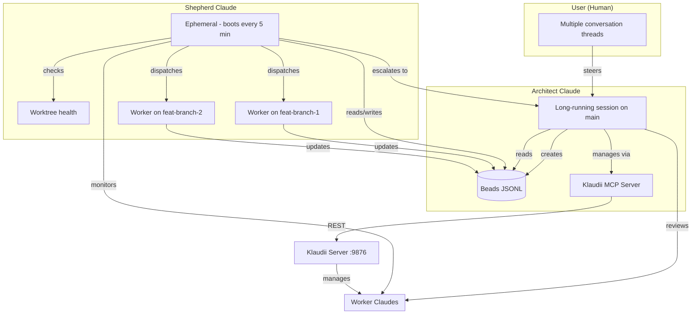
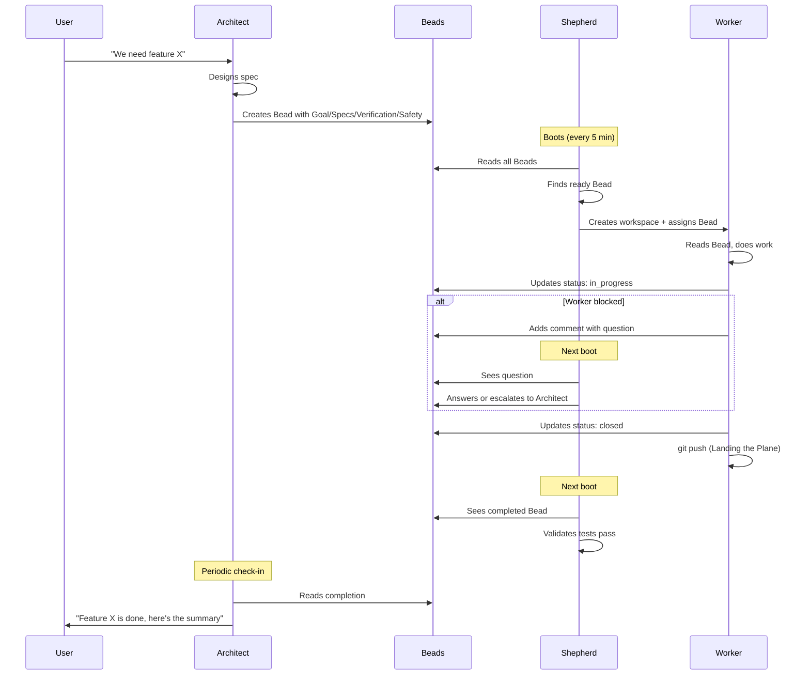
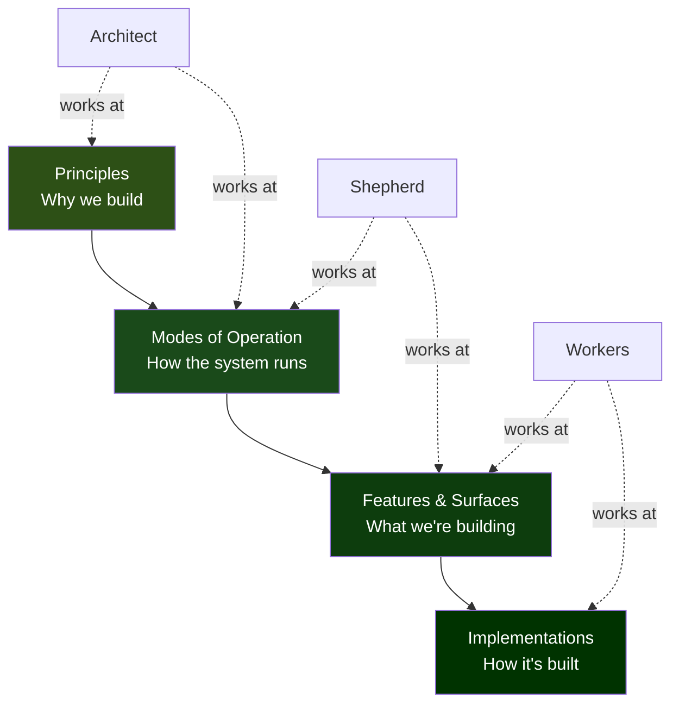
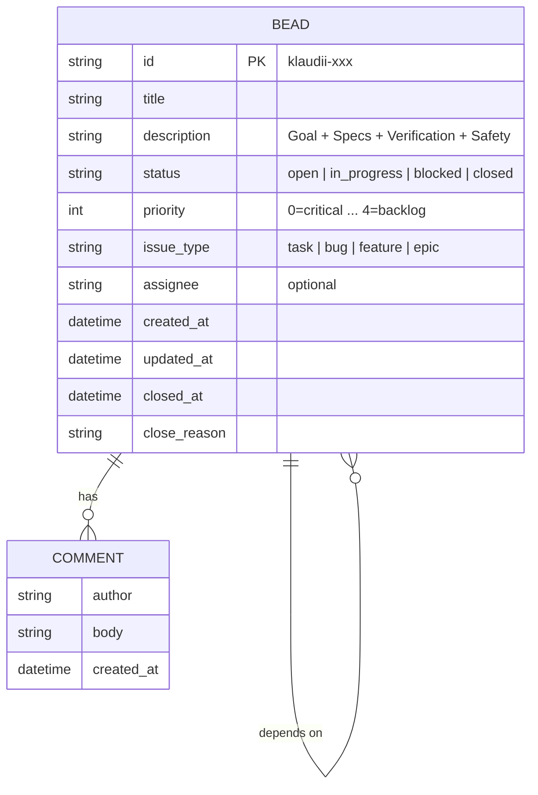
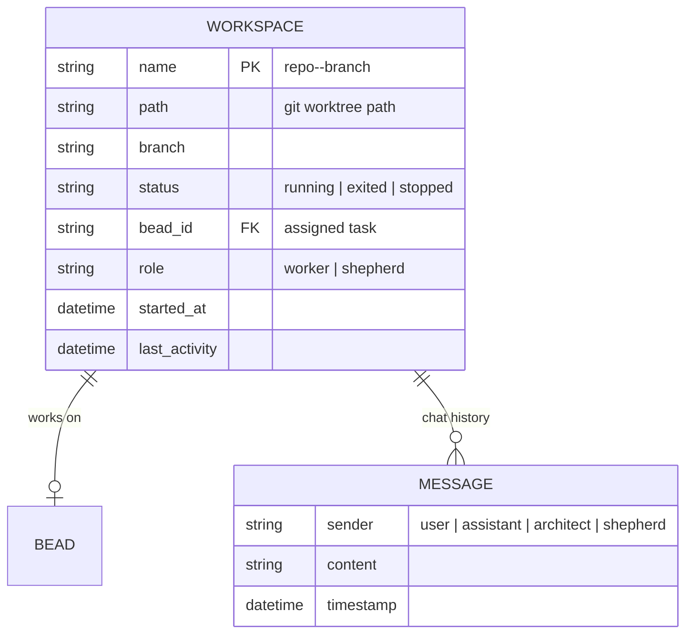
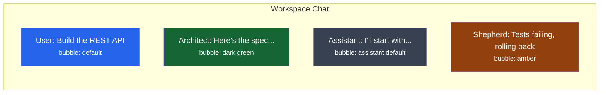
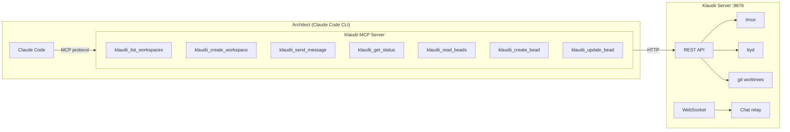
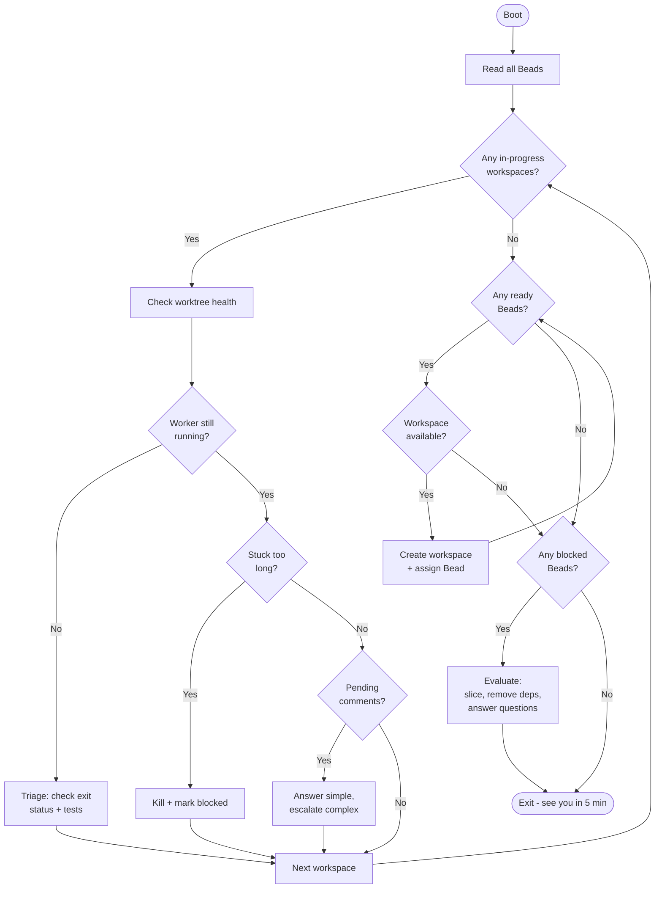
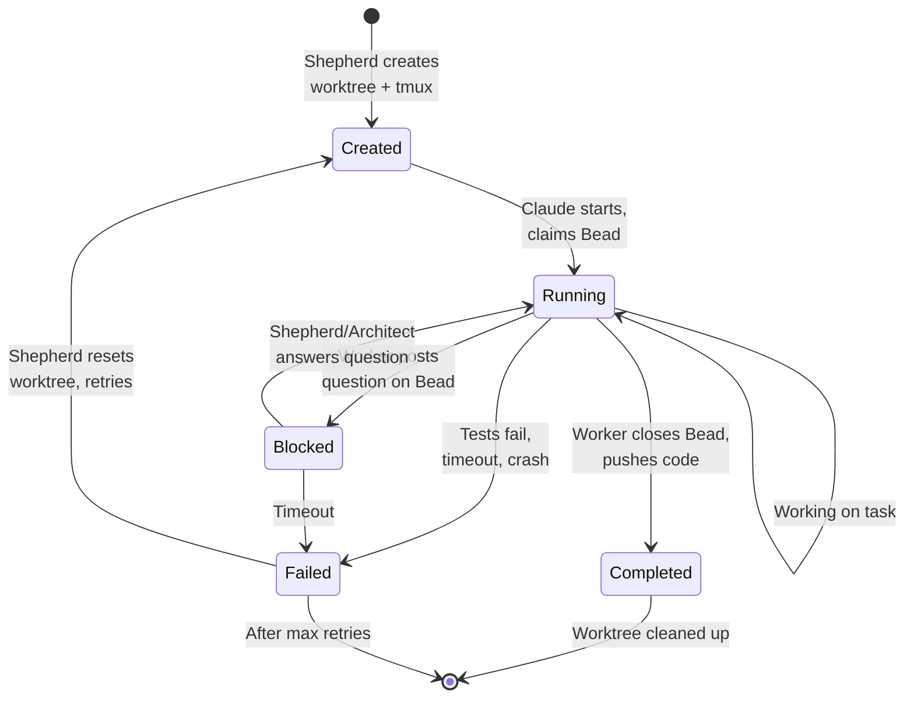

# Klaudii Architect System

A three-tier autonomous build system where Claude instances design, monitor, and build Klaudii.

## Overview



## Roles

### Architect Claude

The strategic brain. Lives on `main` in a long-running Klaudii session.

**Does:**
- Discusses product direction with the user
- Designs features, writes specs
- Creates Beads with SCRUM_MASTER rigor (Goal, Specs, Verification, Safety)
- Reviews completed work at a high level
- Makes judgment calls about scope, priority, approach

**Does NOT:**
- Read source files directly
- Run tests or builds
- Edit code
- Hold operational state (delegates to Shepherd)

### Shepherd Claude

The operations manager. Boots every ~5 minutes, reads state, acts, exits.

**Does:**
- Reads all Beads to build a picture of system state
- Checks worktree health (git status, test results, stuck processes)
- Dispatches ready Beads to available workspaces
- Files fix Beads when tests break
- Rolls back bad commits
- Answers simple worker questions via Bead comments
- Escalates design questions to the Architect

**Key property:** Fresh context every run. Compaction is impossible.

### Worker Claude

The builder. Lives on a feature branch in a git worktree.

**Does:**
- Receives a Bead, does the work
- Updates Bead status via `bd`
- Leaves comments if blocked
- May decompose its task into sub-Beads
- Follows Landing the Plane protocol (push before exit)

**Does NOT:**
- Initiate conversations
- Talk to other Workers
- Make architectural decisions

## Communication Flow



## Shared Knowledge Hierarchy

All participants share the same understanding, layered by abstraction:



This hierarchy lives in project docs: `AGENTS.md`, `CLAUDE.md`, `planning/`.

## Data Model

### Bead (Task)



### Workspace



### Chat Message with Sender



## Infrastructure

### Klaudii MCP Server

A Node.js MCP server the Architect connects to via Claude Code's MCP configuration.



### MCP Tool Specifications

| Tool | Parameters | Returns |
|------|-----------|---------|
| `klaudii_list_workspaces` | none | Array of workspace status objects |
| `klaudii_create_workspace` | `repo`, `branch`, `bead_id?` | Workspace name, path, tmux session |
| `klaudii_send_message` | `workspace`, `message`, `sender?` | Ack |
| `klaudii_get_status` | `workspace` | Status, git info, bead state, pending questions |
| `klaudii_read_beads` | `filter?` (status, priority) | Full Beads JSONL parsed as JSON array |
| `klaudii_create_bead` | `title`, `description`, `priority?`, `deps?`, `type?` | Created bead object |
| `klaudii_update_bead` | `id`, `status?`, `comment?`, `assignee?` | Updated bead object |

### REST API Additions

New endpoints on the Klaudii server to support the MCP tools:

| Endpoint | Method | Purpose |
|----------|--------|---------|
| `/api/chat/:workspace/send` | POST | Send message to workspace Claude |
| `/api/chat/:workspace/status` | GET | Workspace chat status + pending questions |
| `/api/beads` | GET | Read all beads (JSONL parsed to JSON) |
| `/api/beads` | POST | Create a new bead |
| `/api/beads/:id` | PATCH | Update bead status/comment |
| `/api/beads/:id` | GET | Get single bead details |

These wrap existing WebSocket functionality (for chat) and `bd` CLI commands (for beads) behind REST endpoints.

## Shepherd Loop Detail



## Workspace Lifecycle



## Clean Worktree Guarantee

Every worker session MUST start with a clean worktree:

```bash
# When creating a new workspace for a Bead:
git worktree add --detach <worktree-path> main
cd <worktree-path>
git checkout -B <branch-name> origin/main

# When reusing an existing workspace for a new Bead:
cd <worktree-path>
git reset --hard
git clean -fd
git fetch origin main
git checkout -B <branch-name> origin/main
```

This prevents stale Bead changes or uncommitted code from a previous session from confusing the next worker.

## Bead Authoring Standard (SCRUM_MASTER Rigor)

Every task Bead created by the Architect MUST contain:

### A. Goal (The "What")
One sentence summary of the deliverable.

### B. Specs (The "How")
Strict constraints: file paths, function signatures, behavior requirements.

### C. Verification (The "Proof")
Exact commands to run and expected output. Must be falsifiable.

### D. Safety (The "Brakes")
Explicit instructions on when to STOP and escalate.

**Example:**
```
Goal: Add REST endpoint POST /api/chat/:workspace/send that sends a message
to a workspace Claude session.

Specs:
- Add route in routes/v1.js
- Accept JSON body: { message: string, sender?: "user"|"architect"|"shepherd" }
- Use existing claudeChat.appendMessage() for active relays
- Use backendModule.sendMessage() for new conversations
- Return { ok: true } on success
- Persist sender field in chat history

Verification:
- Server starts without errors: node server.js
- curl -X POST http://localhost:9876/api/chat/test-workspace/send \
    -H 'Content-Type: application/json' \
    -d '{"message":"hello","sender":"architect"}'
  returns 200 with { ok: true }

Safety:
- Do NOT modify the WebSocket handler — only add REST route
- Do NOT change existing history format — only ADD sender field
- If claudeChat module needs changes, limit to additive changes only
```

## Implementation Phases

### Phase 0: Foundation (current)
- [x] Init Beads in klaudii repo
- [ ] REST API: POST /api/chat/:workspace/send
- [ ] REST API: GET /api/chat/:workspace/status
- [ ] REST API: Beads CRUD endpoints
- [ ] Message model: add `sender` field to chat history persistence
- [ ] Frontend: colored bubbles for architect/shepherd messages
- [ ] Klaudii MCP server (Node.js, wraps REST endpoints)
- [ ] Clean worktree guarantee on workspace creation

### Phase 1: Worker Loop
- [ ] Architect creates Beads and spins up Worker workspaces via MCP
- [ ] Workers execute Beads, update status via `bd`, leave comments
- [ ] Architect reviews results via MCP

### Phase 2: Shepherd
- [ ] Shepherd script that boots every 5 min (cron or Klaudii scheduler)
- [ ] Reads Beads, checks worktree health, dispatches work
- [ ] Files fix Beads, rolls back bad commits
- [ ] Answers simple questions, escalates design issues

### Phase 3: Full Autonomy
- [ ] Bootstrap-from-doc workflow
- [ ] Architect recovers state across sessions via memory
- [ ] Shepherd runs continuously
- [ ] System self-improves

## Lessons from Machinator

Patterns we adopt from the Machinator project:

1. **Lost Agent Assumption** — every Bead must be self-contained; assume the worker has zero prior context
2. **Trust But Verify** — never assume an action worked; always check
3. **Code Exists != Working** — verification must be *run*, not assumed
4. **Landing the Plane** — work isn't done until `git push` succeeds
5. **Coordination via State** — agents coordinate through Beads, not chat
6. **Ephemeral Agents** — 2-10 min tasks are more reliable than long-running ones
7. **Scrum Master as Skill** — any Claude may create/groom Beads as part of their work
8. **Merge Conflicts are Signals** — if two agents touch the same Bead, coordination failed
